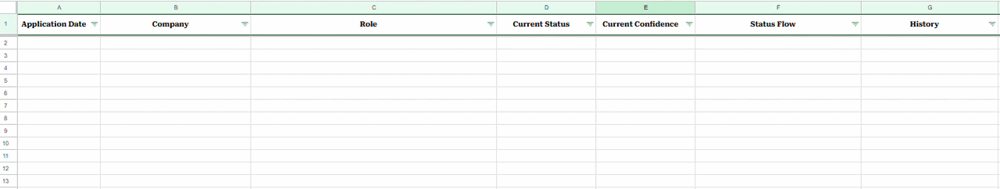
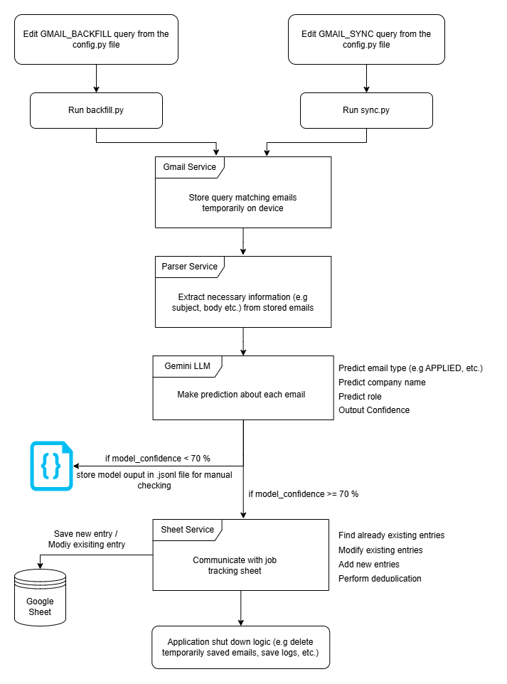

# Job Application Tracker

---

Automate job application tracking by parsing Gmail emails and logging them to Google Sheets by using Gmail API, Google Sheets API, OAuth 2.0, Gemini LLM and Python.



---

## (Backfilling + Sync) Pipeline Overview
<p align="center">
  
</p>

---

## Project Modes

Project has mainly two modes:
1. Backfilling mode (one time) - Backfill all the previous applications data from emails into google sheet
2. Sync mode (daily/weekly) - Manually run sync pipeline on daily/weekly basis or automate syncing via **Task Scheduler** for windows or via **Cron Job** for linux.

---

## How to use?

1. Clone the repository
    ````commandline
    git clone https://github.com/Devashish-Pisal/job-application-tracker.git
    ````
2. Create ``credentials.json``, ``token.json`` files in `data\` folder.
   
3. Google cloud project setup
   - Create project in google cloud console.
   - Setup OAuth for the project. 
   - Paste OAuth credentials into ``credentials.json`` file.
     - It should look like following: 
     ````python
        {"installed":
           {"client_id":xyz.apps.googleusercontent.com,
            "project_id":xyz_id,
            "auth_uri": uri_1 ,
            "token_uri": uri_2,
            "auth_provider_x509_cert_url": uri_3,
            "client_secret": xyz_secret,
            "redirect_uris":[uri_4]}
        }
   - Grant project access to gmail and google sheets.
   - Paste access token into ``token.json`` file.
     - It should look like following:
       `````python
         {
            "token": token_1, 
            "refresh_token": token_2, 
            "token_uri": uri_1, 
            "client_id": xyz.apps.googleusercontent.com, 
            "client_secret": xyz_secret, 
            "scopes": [uri_2, uri_3], 
            "universe_domain": "googleapis.com", 
            "account": "", 
            "expiry": "2026-05-05T12:12:44.978826Z"
         }


4. Create a Google sheet on Google cloud 
   - Name the sheet **job_applications** (If custom name is used then edit the *SHEET_NAME* variable in `src\config.py` file)
   - To name the columns of sheet refer *SHEET_COLUMN_NAME_INDEX_MAPPING* variable from `src\config.py` file. 
   - Format the sheet as per your taste (e.g font styles, font size, conditional color formatting, text alignment, etc.)

5. Create ``.env`` file in project root
   - Paste following text into ```.env``` file by replacing it with your own id's and keys
   ````python
    SHEET_ID="your-google-sheet-id"
    GEMINI_API_KEY="your-gemini-api-key"
    GOOGLE_PROJECT_ID="your-google-cloud-project-id"


6. Open console in project root directory and install all necessary packages with following command
    ````commandline
    pip install -r requirements.txt
    ````

7. Edit ``src\config.py`` file
   - If Backfilling: If required, edit the **GMAIL_BACKFILL_QUERY** (e.g adjust time frame, exclude specific senders, adjust application matching keywords, etc.)
   - If Syncing: If required, edit the **GMAIL_SYNC_QUERY** (e.g add specific labels, adjust time frame, etc.)
   - If you want to use different gemini model/setting, then edit **GEMINI_CONFIG**

8. Run the appropriate file
   - If backfilling, then run ```src\backfill.py```
   - If syncing, then run ```src\sync.py```

---

**Note**: Sometimes if project is not used for some days the authentication token gets invalidated and cannot refresh dynamically at runtime. In that case application throws following error:
````
google.auth.exceptions.RefreshError: ('invalid_grant: Bad Request', {'error': 'invalid_grant', 'error_description': 'Bad Request'})
````
**Solution**: To solve this problem simply follow following steps: 
1. First delete old ``token.json`` file. 
2. Start the application. 
3. Application will open browser to login into google cloud account.
4. Google will prompt to grant application access to the Gmail & Google Sheets. Grant the access. 
5. New ``token.json`` file will be generated automatically, which are can reused & refreshed before expiry. 
---
