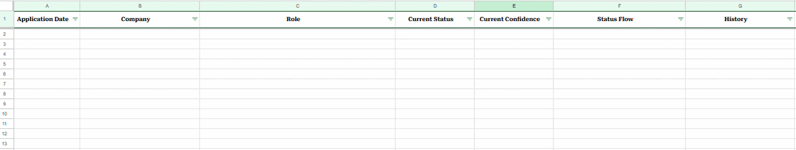
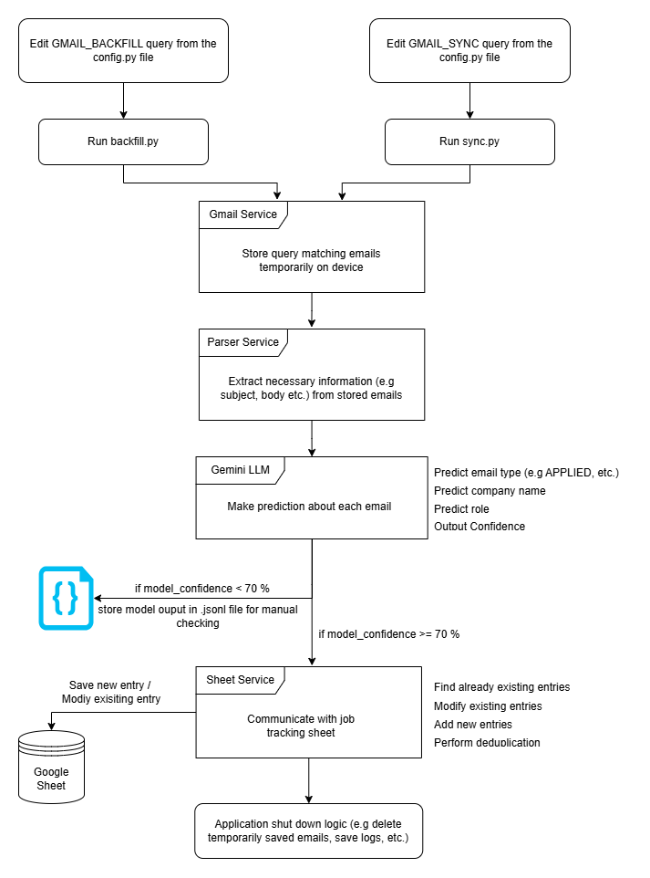

# Job Application Tracker

**A Python pipeline that reads job application emails from Gmail, classifies them with Google Gemini and keeps a deduplicated application tracker in Google Sheets up to date. Built for a bilingual (German/English) job search in Germany.**




**Contents:** [At a glance](#at-a-glance) · [Skills demonstrated](#skills-demonstrated) · [Key features](#key-features) · [Architecture](#architecture) · [How it works](#how-it-works) · [Engineering decisions](#engineering-decisions) · [Data privacy](#data-privacy-and-security) · [Getting started](#getting-started) · [Usage](#usage) · [Troubleshooting](#troubleshooting)

---

## At a glance

| | |
|---|---|
| **Problem** | During a job search in Germany, updates such as confirmations, test invitations, interview invitations, offers and rejections arrive by email, in German and English, from many different companies and applicant tracking systems. Keeping a spreadsheet up to date by hand is slow and error-prone. |
| **Solution** | The pipeline fetches the relevant emails through the Gmail API and uses an LLM with structured JSON output to extract the company, role and application status. It then creates or updates exactly **one row per application** in Google Sheets, including the full status history. |
| **Result** | Used during a real job search. The initial backfill processed **203 emails in one unattended run**. It recorded **135 new applications** and merged **58 status updates** into existing entries. The remaining **10 uncertain cases (≈ 5 %)** went to manual review instead of being written to the sheet. |
| **Scope** | Solo project covering requirements, architecture, prompt design, implementation and day-to-day operation. |
| **Tech stack** | Python 3.12+, Gmail API, Google Sheets API, OAuth 2.0, Google Gemini (`google-genai`), RapidFuzz, pandas, BeautifulSoup, Loguru |

---

## Skills demonstrated

- **Python backend development:** modular, service-based structure (auth, Gmail, parsing, LLM, Sheets), central configuration and structured logging.
- **API integration:** Gmail API (paginated search, MIME parsing) and Google Sheets API (read, append, update), with request pacing that keeps usage within API quotas.
- **Authentication and security:** OAuth 2.0 installed-app flow with automatic token refresh and least-privilege scopes (`gmail.readonly`); secrets are kept out of version control.
- **Applied LLM / GenAI engineering:** prompt design, JSON output constrained by a schema, confidence-based gating and a fallback chain across several models with retries.
- **Data quality:** HTML-to-text cleaning, text normalization, fuzzy matching, deduplication and idempotent processing.
- **Automation:** a one-off backfill plus an incremental sync that can be scheduled with cron (Linux) or Task Scheduler (Windows), and runs that resume after an interruption.

---

## Key features

- **German and English emails:** the Gmail search covers both German and English keywords (*"Ihre Bewerbung"*, *"Vorstellungsgespräch"*, *"Absage"*, *"application received"*, *"interview"*, …). It excludes job-alert emails from job boards such as StepStone, XING, Indeed, LinkedIn and Glassdoor.
- **Normalization for the German job market:** legal forms (*GmbH*, *AG*, *SE*, *GmbH & Co. KG*, …) and gender suffixes (*(m/w/d)*, *(f/m/x)*) are removed. Umlauts are transliterated (*ä → ae*, *ß → ss*), so spelling variants of the same company are recognized as one.
- **Six application statuses:** `APPLIED`, `TEST_INVITATION`, `INTERVIEW`, `OFFER`, `REJECTION` and `OTHER`. If an email fits more than one, a fixed priority order decides.
- **One row per application:** fuzzy matching on company and role links follow-up emails to the existing entry. The status history is recorded, e.g. `APPLIED ⟶ INTERVIEW ⟶ REJECTION`.
- **Manual review for uncertain cases:** LLM results below 70 % confidence and ambiguous matches are never written to the sheet automatically. They are logged to JSONL files for manual review instead.
- **Idempotent and resumable:** each row stores the Gmail message IDs it was built from, so an email that is already in the sheet is not added again. Downloaded emails are deleted only after they have been processed, so an interrupted run continues where it stopped.
- **Full audit trail:** every row keeps its history of LLM outputs, sender metadata, subjects and email bodies, truncated to stay within the 50,000-character cell limit of Google Sheets.
- **Designed for free tiers:** tested with free-tier Gemini models. Fixed delays between requests keep usage within the per-minute API limits.

---

## Architecture

<p align="center">
  
</p>

Backfill and sync share the same pipeline. They differ only in the Gmail search query.

```
job-application-tracker/
├── src/
│   ├── backfill.py              # Entry point: one-off import of historical emails
│   ├── sync.py                  # Entry point: incremental sync (daily / weekly)
│   ├── pipeline.py              # Orchestration: parse → classify → match → write
│   ├── config.py                # Gmail queries, sheet column mapping, Gemini settings
│   ├── auth/
│   │   └── google_auth.py       # OAuth 2.0 flow and token refresh
│   ├── services/
│   │   ├── gmail_service.py     # Paginated email download
│   │   ├── parser_service.py    # Header / body extraction (MIME, HTML → text)
│   │   └── sheets_service.py    # Append / update rows, fuzzy matching, status rules
│   ├── llm/
│   │   ├── gemini.py            # Structured extraction, model fallback, retries
│   │   └── local.py             # Experimental: local LLM via Ollama
│   └── utils/
│       └── helpers.py           # Logging, file handling, normalization
├── data/
│   └── prompts/SYSTEM_PROMPT.txt  # Extraction prompt (schema, rules, confidence scale)
├── tests/                       # Unit tests (pytest, mocked API clients)
├── assets/                      # Demo GIF and pipeline diagram
├── path_config.py               # Central path definitions
└── requirements.txt
```

---

## How it works

1. **Fetch:** the Gmail search query (backfill or sync) selects candidate emails. Each message is saved as JSON in `data/fetched_emails/`.
2. **Parse:** the parser extracts the sender, subject, date and body. It prefers `text/plain`, falls back to cleaned HTML and walks nested multipart messages recursively.
3. **Skip known emails:** if the Gmail message ID is already in the sheet, the email is skipped.
4. **Extract and classify:** Gemini receives the system prompt and the email. A response schema with a status enum forces structured JSON (`company`, `job title`, `email_type`, `confidence`). The temperature is 0.1 so that results stay reproducible.
5. **Confidence gate:** results below **0.70** confidence go to the manual review file. Everything else continues.
6. **Match and write:** the pipeline looks for an existing row for the same application, using RapidFuzz `token_set_ratio`, which is robust against word order and extra words:

   | Extracted fields | Matched on | Threshold |
   |---|---|---|
   | Company + role | Both columns | Company ≥ 0.90, role ≥ 0.85 |
   | Company only | Company column | ≥ 0.90 |
   | Role only | Role column | ≥ 0.85 |

   | Matches found | Action |
   |---|---|
   | 0 | Append a new row |
   | 1 | Update that row: set the new status, extend the status flow, history and message IDs, and fill in a missing company or role |
   | > 1 | Write nothing and log the email for manual review |

   **Status rule:** a row only counts as a match if the new status does not move backwards. The order is `APPLIED` → `TEST_INVITATION` / `INTERVIEW` → `OFFER` / `REJECTION`. Suppose a company already rejected an earlier application and a new "application received" email arrives from it. That email starts a **new row** instead of overwriting the old one.

7. **Clean up:** processed emails are deleted from disk, and a log file is written for each run.

### Google Sheet layout

| Column | Field | Example |
|---|---|---|
| A | Application Date | `2026-03-12` (date of the first email) |
| B | Company | `ACME` (stored in upper case) |
| C | Role | `software engineer backend` (stored in lower case) |
| D | Current Status | `INTERVIEW` |
| E | Current Confidence | `0.92` |
| F | Status Flow | `APPLIED ⟶ INTERVIEW` |
| G | History | Full audit trail (LLM output, metadata, subject, body) |
| H | Last Modified | `2026-04-02` |
| I | Message IDs | Comma-separated Gmail message IDs |

---

## Engineering decisions

- **The LLM extracts; deterministic code decides.** The model only turns free text into structured fields. Matching, deduplication and status rules are plain Python, so the sheet stays consistent even when model output varies.
- **Schema-constrained output.** A JSON response schema with an enum for the status means there is no fragile free-text parsing of model answers.
- **Precision over recall.** A wrong entry in the tracker costs more than a quick manual check, so uncertain or ambiguous cases are routed to review files.
- **Resilience on free quotas.** The pipeline tries an ordered list of four Gemini models. Failed requests are retried with exponential backoff and jitter. If a model keeps failing, for example because its daily quota is used up, the next model takes over.
- **Google Sheets as the user interface.** There is no frontend to build or host, and filtering, sorting, conditional formatting and mobile access come with Google Sheets.

---

## Data privacy and security

Job application emails contain personal data, so the project was designed with GDPR (DSGVO) principles in mind:

- **Least privilege:** Gmail access is read-only (`gmail.readonly`). The tool cannot send, change or delete emails.
- **Data minimization:** the Gmail query limits processing to emails about job applications and excludes newsletters, job alerts and other unrelated mail.
- **No extra infrastructure:** the pipeline runs locally, with no server and no database of its own. Downloaded emails are deleted from disk once they have been processed.
- **Secrets stay local:** `credentials.json`, `token.json` and `.env` are excluded through `.gitignore`.
- **Data shared with Google:** the email content is sent to the Google Gemini API for extraction. The full text is also stored in the history column of your own Google Sheet. On the Gemini free tier, Google may use the content you submit to improve its products. Use a paid tier, or the planned local-LLM option, where stricter requirements apply.

---

## Getting started

### Prerequisites

- Python **3.12 or newer**
- A Google account with Gmail
- A Google Cloud project (free)
- A Gemini API key from [Google AI Studio](https://aistudio.google.com/) (the free tier is enough)

### 1. Clone and install

```bash
git clone https://github.com/Devashish-Pisal/job-application-tracker.git
cd job-application-tracker
python -m venv venv
source venv/bin/activate          # Windows: venv\Scripts\activate
pip install -r requirements.txt
```

### 2. Set up Google Cloud

1. Create a project in the [Google Cloud Console](https://console.cloud.google.com/).
2. Enable the **Gmail API** and the **Google Sheets API**.
3. Configure the **OAuth consent screen** with the user type *External*, and add your Google account as a test user.
4. Create an **OAuth client ID** of type *Desktop app*, download the JSON file and save it as `data/credentials.json`.

You don't need to create `data/token.json` yourself. On the first run, a browser window opens; sign in and grant access to Gmail (read-only) and Google Sheets. The token is then created and refreshed automatically.

### 3. Create the Google Sheet

1. Create a new spreadsheet and keep the first worksheet tab named **`Sheet1`**. The code addresses this tab directly.
2. Put the nine column headers from the [sheet layout](#google-sheet-layout) (columns A–I) in **row 1**. Data starts in row 2.
3. Copy the spreadsheet ID from the URL: `https://docs.google.com/spreadsheets/d/<SHEET_ID>/edit`.
4. Optional: add formatting, for example conditional colors per status.

### 4. Configure environment variables

Create a `.env` file in the project root:

```dotenv
SHEET_ID="your-google-sheet-id"
GEMINI_API_KEY="your-gemini-api-key"
```

### 5. Adjust the configuration

Edit `src/config.py` if needed:

| Setting | Purpose |
|---|---|
| `GMAIL_BACKFILL_QUERY` | Date range (`after:` / `before:`), application keywords and excluded senders for the one-off import. Adapt the exclusion list to your own inbox. |
| `GMAIL_SYNC_QUERY` | Query for the incremental sync. The default is `label:jobsuche`: create a Gmail filter that applies this label, or use something like `newer_than:1d` instead. |
| `GEMINI_CONFIG` | Model order, temperature, number of retries and the delay between requests. |

---

## Usage

Run the commands from the **project root**, as modules:

```bash
python -m src.backfill   # One-off: import historical emails
python -m src.sync       # Incremental: run daily or weekly
```

### Scheduling the sync

Run the sync once by hand first so that `token.json` exists, then schedule it.

**Linux (cron)**, daily at 08:00:

```cron
0 8 * * * cd /path/to/job-application-tracker && venv/bin/python -m src.sync
```

**Windows (Task Scheduler):** create a task with the action *Start a program*, using these settings:
- Program: `C:\path\to\job-application-tracker\venv\Scripts\python.exe`
- Arguments: `-m src.sync`
- Start in: `C:\path\to\job-application-tracker`

### Output and manual review

| Location | Content |
|---|---|
| Google Sheet | One row per application |
| `data/manual_check/llm_low_confidence_output.jsonl` | LLM results below 70 % confidence |
| `data/manual_check/duplicate_by_fuzzy_matching.jsonl` | Ambiguous matches (more than one candidate row) |
| `data/manual_check/duplicate_by_msg_id.jsonl` | Emails that are already in the sheet |
| `data/logs/` | One log file per run |

> **Note:** some emails stay in `data/fetched_emails/`: low-confidence results, emails whose message ID is already in the sheet, and leftovers from an interrupted run. The next run processes this folder **instead of** fetching new emails. Clear it after reviewing so that new emails are fetched again.

---

## Troubleshooting

**`google.auth.exceptions.RefreshError: ('invalid_grant: Bad Request', ...)`**

The stored refresh token has expired or been revoked. This usually happens when the OAuth app is in the *Testing* publishing status, where Google refresh tokens expire after 7 days.

1. Delete `data/token.json`.
2. Run the application again. A browser window opens.
3. Sign in and grant access to Gmail and Google Sheets.
4. A new `token.json` is created and refreshed automatically from then on.

**`ModuleNotFoundError: No module named 'src'`**

Start the scripts from the project root with `python -m src.sync` rather than `python src/sync.py`.

---

## Known limitations and next steps

- **Local LLM:** finish the Ollama integration (`src/llm/local.py`) so that emails can be processed fully offline.
- **Tests and CI:** bring the unit tests (pytest, mocked API clients) in line with the current code base, and run them automatically with GitHub Actions.
- **Configurable sheet layout:** the worksheet name (`Sheet1`) and the column order (A–I) are currently fixed in the code.
- **Fewer API calls:** read the sheet once per run instead of once per email, to speed up large backfills.

---

## Author

**Devashish Pisal** · [GitHub](https://github.com/Devashish-Pisal)
